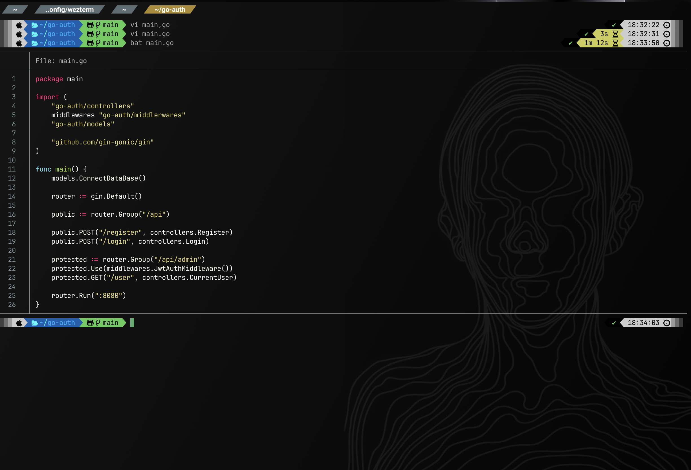

## 📂 dotfiles 

## WezTerm Setup
To apply this configuration, place the files in the following directory
```bash:bash
~/.config/wezterm
```

### Features
- Customized colors and themes
- Background image setup
    - To set a custom background image, place your image file inside the `~/.config/wezterm/` directory.
    - Then, reference the image path in your `background.lua` file as follows ↓
    ```
    local background_image = "/Users/<your-username>/.config/wezterm/<image-file>"
    ```
- `Powerlevel10k` integration (if applicable)
- Other tweaks and enhancements

### My WezTerm Overview
 
