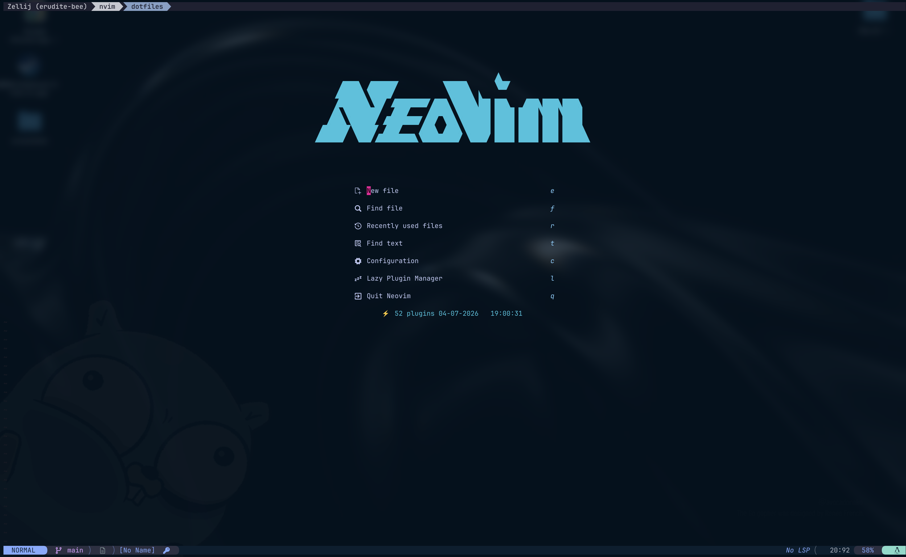

<div align="center">

# Dotfiles

**A macOS development environment tuned around Nix, Neovim, WezTerm, and fast terminal workflows.**

<p>
  
  
</p>



</div>

## Overview

This repository is the source of truth for my `~/.config`.

It is built for a keyboard-first macOS setup: reproducible packages through Nix, a Lua-based Neovim IDE, a highly customized terminal stack, and small CLI tools wired together for day-to-day engineering work.

## Stack

| Area | Tools |
| --- | --- |
| System | Nix, nix-darwin, Home Manager |
| Editor | Neovim nightly, Lua, LSP, Treesitter, Telescope |
| Terminal | WezTerm, Zellij, Starship, Fish |
| UI | SketchyBar, Fastfetch |
| CLI | GitHub CLI, lazygit, ghq, ripgrep, fd, fzf, eza, bat, zoxide |
| Files | Yazi, htop, btop |
| Dev | Go, Node.js, Rust, Terraform, Docker-adjacent tooling |

## Highlights

- `flake.nix` defines the macOS/Home Manager entrypoint.
- `nvim/` contains the editor configuration, split into options, keybinds, extensions, LSP, and templates.
- `wezterm/` keeps terminal appearance, keymaps, transparency, and background behavior isolated.
- `zellij/` provides modal terminal multiplexing with explicit pane/tab workflows.
- `sketchybar/` drives the macOS status bar with Lua modules and helper binaries.
- `yazi/` adds a fast terminal file manager with git-aware fetchers.

## Layout

```text
.
├── flake.nix
├── nix/
│   ├── darwin/
│   └── home/
├── nvim/
├── wezterm/
├── zellij/
├── sketchybar/
├── yazi/
├── fish/
├── btop/
├── fastfetch/
└── img/
```

## Apply

This repo is intended to live directly at `~/.config`.

```sh
cd ~/.config
darwin-rebuild switch --flake .#fujimotoikkinoMacBook-Air-2
```

## Notes

This is a personal environment, not a generic starter kit. Secrets, machine-local state, caches, and app-generated databases are intentionally excluded from git.

The goal is simple: keep the actual working config under version control, without copying files back and forth.
