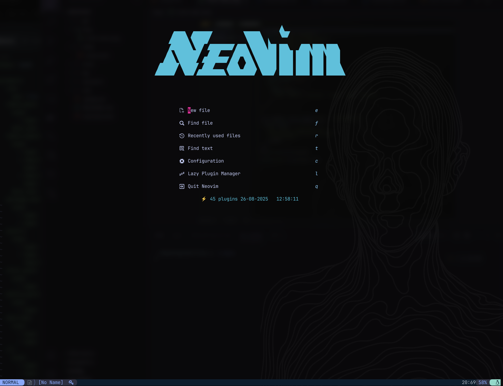

## 📂 dotfiles 
[](https://app.fossa.com/projects/custom%2B51440%2Fgit%40github.com%3Aanton-fuji%2Fdotfiles.git?ref=badge_small)


## WezTerm Setup
To apply this configuration, place the files in the following directory
```bash:bash
~/.config/wezterm
```

### My WezTerm Overview
 
