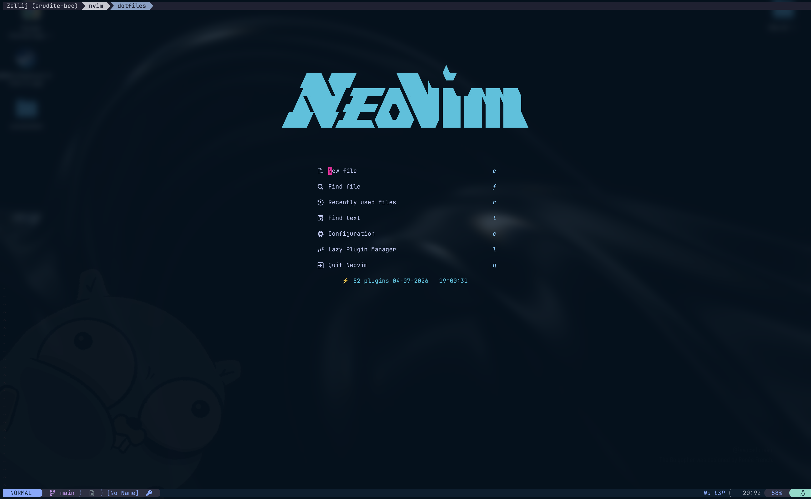

<div align="center">

# Dotfiles

**A macOS development environment tuned around Nix, Neovim, WezTerm, and fast terminal workflows.**

<p>
  
  
  
  
</p>



<sub>Terminal background artwork by <a href="https://x.com/avocadoneko">@avocadoneko</a>.</sub>

</div>

## Overview

This repository is the source of truth for my `~/.config`.

It is built for a keyboard-first macOS setup: reproducible packages through Nix, a Lua-based Neovim IDE, a highly customized terminal stack, and small CLI tools wired together for day-to-day engineering work.

## Stack

| Area | Tools |
| --- | --- |
| System | Nix, nix-darwin, Home Manager |
| Editor | Neovim nightly, Lua, LSP, Treesitter, Telescope |
| Terminal | WezTerm, Zellij, Starship, Fish |
| UI | SketchyBar, Fastfetch |
| CLI | GitHub CLI, lazygit, ghq, ripgrep, fd, fzf, eza, bat, zoxide |
| Files | Yazi, htop, btop |
| Dev | Go, Node.js, Rust, Terraform, Docker-adjacent tooling |

## Highlights

- `flake.nix` defines the macOS/Home Manager entrypoint.
- `nvim/` contains the editor configuration, split into options, keybinds, extensions, LSP, and templates.
- `wezterm/` keeps terminal appearance, keymaps, transparency, and background behavior isolated.
- `zellij/` provides modal terminal multiplexing with explicit pane/tab workflows.
- `sketchybar/` drives the macOS status bar with Lua modules and helper binaries.
- `yazi/` adds a fast terminal file manager with git-aware fetchers.

## Neovim plugins

<details>
<summary><strong>UI and appearance</strong></summary>

| Plugin | Purpose |
| --- | --- |
| `folke/tokyonight.nvim` | TokyoNight Storm color scheme with transparent editor background. |
| `nvim-lualine/lualine.nvim` | Global status line. |
| `akinsho/bufferline.nvim` | Buffer tabs and diagnostics. |
| `goolord/alpha-nvim` | Start dashboard. |
| `folke/noice.nvim` + `rcarriga/nvim-notify` | Command-line, messages, and notifications UI. |
| `Bekaboo/dropbar.nvim` | File-path and symbol breadcrumbs in the winbar. |
| `shellRaining/hlchunk.nvim` | Indent guides and scope highlighting. |
| `echasnovski/mini.animate` | Small UI animations. |
| `nvim-tree/nvim-web-devicons` | Filetype icons. |
| `MeanderingProgrammer/render-markdown.nvim` | Rendered Markdown previews in-buffer. |
</details>

<details>
<summary><strong>Navigation and files</strong></summary>

| Plugin | Purpose |
| --- | --- |
| `nvim-telescope/telescope.nvim` | Fuzzy finding for files, text, buffers, and more. |
| `nvim-telescope/telescope-file-browser.nvim` | File-browser picker for Telescope. |
| `nvim-telescope/telescope-project.nvim` | Project picker for Telescope. |
| `tom-anders/telescope-vim-bookmarks.nvim` + `MattesGroeger/vim-bookmarks` | Bookmark search and management. |
| `nvim-tree/nvim-tree.lua` | Sidebar file explorer. |
| `stevearc/oil.nvim` | Edit directories like regular buffers. |
| `folke/flash.nvim` | Fast jump navigation. |
| `kevinhwang91/nvim-hlslens` | Search match count and navigation lens. |
| `dnlhc/glance.nvim` | Definitions, references, and implementations picker. |
</details>

<details>
<summary><strong>Coding and language support</strong></summary>

| Plugin | Purpose |
| --- | --- |
| `neovim/nvim-lspconfig` | Language Server Protocol configuration. |
| `williamboman/mason.nvim` + `williamboman/mason-lspconfig.nvim` | Install and connect language servers. |
| `nvimtools/none-ls.nvim` + `jay-babu/mason-null-ls.nvim` | External formatters and linters through LSP. |
| `nvim-treesitter/nvim-treesitter` + textobjects | Syntax highlighting, structural selection, and text objects. |
| `hrsh7th/nvim-cmp` | Completion menu. |
| `L3MON4D3/LuaSnip` + `rafamadriz/friendly-snippets` | Snippet engine and snippet collection. |
| `onsails/lspkind-nvim` | Icons and labels in completion items. |
| `windwp/nvim-autopairs` | Automatic bracket and quote pairs. |
| `numToStr/Comment.nvim` | Line and block comments. |
| `echasnovski/mini.surround` | Add, delete, and replace surrounding pairs. |
| `mattn/vim-sonictemplate` | Template insertion. |
</details>

<details>
<summary><strong>Git, terminal, and tasks</strong></summary>

| Plugin | Purpose |
| --- | --- |
| `lewis6991/gitsigns.nvim` | Git change signs, hunk staging, and previews. |
| `sindrets/diffview.nvim` | Side-by-side Git diff and file-history views. |
| `stevearc/overseer.nvim` | Project task runner and job manager. |
| `akinsho/toggleterm.nvim` | Toggleable terminal windows. |
| `kazhala/close-buffers.nvim` | Close buffers while preserving window layout. |
| `folke/trouble.nvim` | Diagnostics, quickfix, and location-list UI. |
</details>

## Layout

```text
.
├── flake.nix
├── justfile
├── nix/
│   ├── darwin/
│   └── home/
├── nvim/
├── wezterm/
├── zellij/
├── sketchybar/
├── yazi/
├── fish/
├── btop/
├── fastfetch/
└── img/
```

## Bootstrap

This repo is intended to live directly at `~/.config`.

1. Install Nix with flakes enabled.
2. Install nix-darwin.
3. Clone this repository to `~/.config`.
4. Apply the host configuration.

```sh
cd ~/.config
just switch
```

Without `just`:

```sh
cd ~/.config
darwin-rebuild switch --flake .#fujimotoikkinoMacBook-Air-2
```

## Commands

```sh
just fmt      # format Nix files
just check    # evaluate flake outputs without building
just dry-run  # show what Nix would build/fetch
just build    # build the darwin system closure
just switch   # apply the darwin configuration
just update   # update flake.lock
```

## Notes

This is a personal environment, not a generic starter kit. Secrets, machine-local state, caches, and app-generated databases are intentionally excluded from git.

The goal is simple: keep the actual working config under version control, without copying files back and forth.
